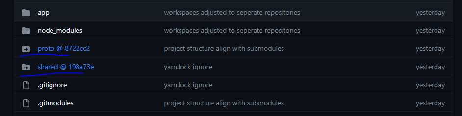

# Subrepo (Sub Modules) rehberi

## Subrepo nedir?
Git repository'si icinde baska bir repository olarak dusunebilir


Bir utilty reposu var diyelim bu repodaki proje baska repolarda alt yapi olarak kullanilacak diyelim. bu repoyu submodules sayesinde baska bir repoya dahil edebiliyoruz

## ornek;

app ve utils adinda iki repomuz var diyelim. Ve bu 2 repo hali hazirda githubda durdugunu varsayalim app reposu utils reposundaki kodlari bir sekilde kullanacak


```bash
#app reposunu app/ dizinine clone ladik.
git clone git@github.com:birkullanici/app app

# simdi utils reposunu app/utils yoluna dahil edelim
# ilk olarak app dizinine gidelim
cd app

# utils reposunu submodule olarak klonlayalim
git submodule add git@github.com:birkullanici/utils utils
# sub repomuz app/utils dizinine clonelanacak
```

  
Resimde goruldugu gibi submoduller githubda bu sekilde gosteriliyor.
Artik bu klasorler sadece bir placeholder yada sembolik link gorevi goruyor o dizinlerin contenti baska bir repositorye ait


